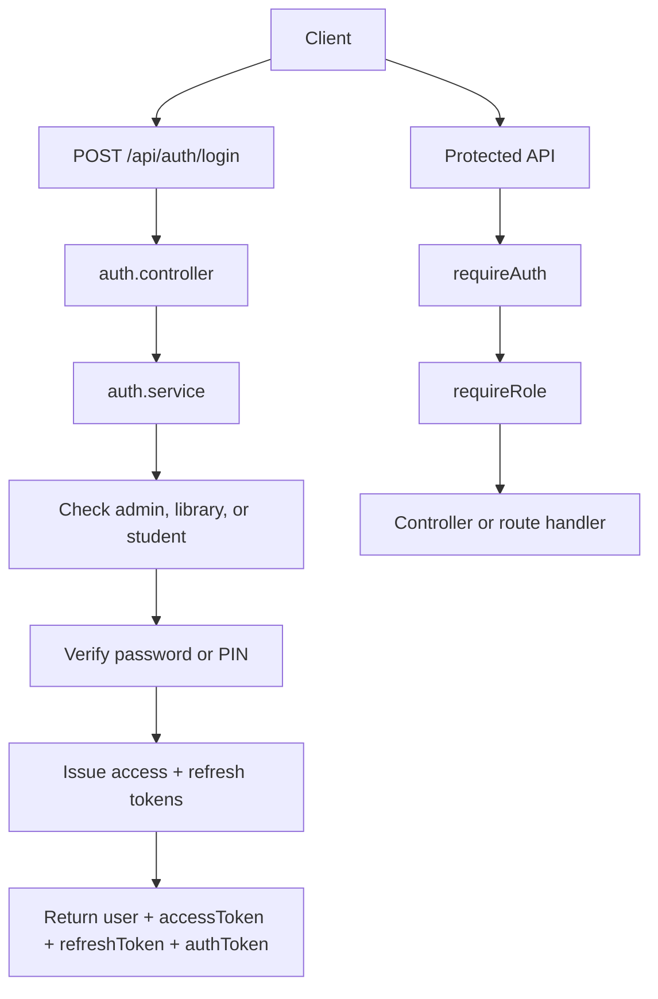

# Authentication README

This document explains the current LibDesk backend authentication system: login, JWT usage, roles, middleware, response format, and security behavior.

## Auth Files

Main files:

- `src/routes/auth.routes.js`
- `src/controllers/auth.controller.js`
- `src/services/auth.service.js`
- `src/middleware/auth.middleware.js`
- `src/middleware/role.middleware.js`
- `src/middleware/error.middleware.js`
- `src/models/Library.js`
- `src/models/Student.js`

## Required Environment Variables

Set one JWT secret in `backend/.env`:

```env
AUTH_JWT_SECRET=replace_with_long_random_secret
AUTH_REFRESH_TOKEN_SECRET=replace_with_second_long_random_secret
```

Fallback supported by middleware:

```env
JWT_SECRET=replace_with_long_random_secret
REFRESH_TOKEN_SECRET=replace_with_second_long_random_secret
```

Admin login env:

```env
ADMIN_USERNAME=admin
ADMIN_PIN=admin@123
ADMIN_MOBILE=0000000000
```

Important:

- Do not use short secrets in production.
- Use different values for access-token and refresh-token secrets in production.
- Do not commit `.env`.
- Restart the backend after changing secrets.

## Response Format

Auth APIs use the shared response format:

```json
{
  "success": true,
  "data": {},
  "message": "Success"
}
```

Errors use:

```json
{
  "success": false,
  "data": null,
  "message": "Error message"
}
```

## Login Endpoint

### `POST /api/auth/login`

Route:

```js
router.post("/login", authController.login);
```

The controller sanitizes request input and calls `authService.login()`.

### Admin Login

Request:

```json
{
  "usernameOrMobile": "admin",
  "pin": "admin@123"
}
```

Admin credentials come from env:

- `ADMIN_USERNAME`
- `ADMIN_PIN`
- `ADMIN_MOBILE`

Current code also accepts `admin123` for admin PIN compatibility.

### Library Login

Request:

```json
{
  "email": "library@example.com",
  "password": "password123",
  "role": "library"
}
```

Flow:

1. Find library by email.
2. Check `library.isActive`.
3. Check subscription status.
4. Compare password with `bcrypt.compare(password, library.passwordHash)`.
5. Return library user data and JWT.

### Student Login

Request:

```json
{
  "usernameOrMobile": "9999999999",
  "pin": "1234",
  "role": "student"
}
```

Flow:

1. Find non-deleted student by mobile.
2. Check `student.isBlocked`.
3. Verify PIN with `student.verifyPin(pin)`.
4. Return student user data and JWT.

## Login Success Response

Current response:

```json
{
  "success": true,
  "data": {
    "user": {
      "id": "USER_ID",
      "role": "library",
      "libraryId": "LIBRARY_ID",
      "name": "Library Name"
    },
    "accessToken": "SHORT_LIVED_JWT",
    "refreshToken": "LONG_LIVED_REFRESH_TOKEN",
    "authToken": "SHORT_LIVED_JWT"
  },
  "message": "Login successful"
}
```

Use `authToken` or `accessToken` on protected API calls. `authToken` is kept as a backward-compatible alias for existing clients.

## Register Library Endpoint

### `POST /api/auth/register-library`

Request:

```json
{
  "libraryName": "My Library",
  "ownerName": "Owner Name",
  "email": "owner@example.com",
  "password": "password123",
  "city": "Delhi"
}
```

Flow:

1. Validate required fields.
2. Hash password using bcrypt.
3. Create library.
4. Return library user, access token, refresh token, `authToken`, and `libraryCode`.

Success response:

```json
{
  "success": true,
  "data": {
    "user": {},
    "accessToken": "SHORT_LIVED_JWT",
    "refreshToken": "LONG_LIVED_REFRESH_TOKEN",
    "authToken": "SHORT_LIVED_JWT",
    "libraryCode": "ABCDE"
  },
  "message": "Library registered successfully"
}
```

## JWT Token

JWT payload:

```json
{
  "userId": "USER_ID",
  "role": "library",
  "libraryId": "LIBRARY_ID"
}
```

Current access token expiry:

```js
{ expiresIn: "15m" }
```

Supported roles:

- `admin`
- `library`
- `student`

## Protected Requests

Send the token in the Authorization header:

```http
Authorization: Bearer JWT_TOKEN
```

Example:

```bash
curl http://localhost:1998/api/students \
  -H "Authorization: Bearer JWT_TOKEN"
```

## Auth Middleware

File:

```txt
src/middleware/auth.middleware.js
```

`requireAuth` does:

1. Requires `AUTH_JWT_SECRET` or `JWT_SECRET`.
2. Validates `Authorization: Bearer <token>` format.
3. Verifies JWT.
4. Handles expired token separately.
5. Validates payload has `userId` and valid `role`.
6. Attaches user context:

```js
req.user = {
  userId,
  role,
  libraryId,
};
```

Common errors:

- Missing header: `Authorization header missing`
- Wrong header format: `Authorization header must use Bearer token`
- Expired token: `Auth token expired`
- Invalid token: `Invalid auth token`
- Bad payload: `Invalid auth token payload`

## Role Middleware

File:

```txt
src/middleware/role.middleware.js
```

Usage:

```js
router.get("/admin-only", requireAuth, requireRole("admin"), controller);
router.get("/library-only", requireAuth, requireRole("library"), controller);
router.get("/shared", requireAuth, requireRole("admin", "library"), controller);
```

If role is missing or not allowed, API returns `403 Forbidden`.

## Route Protection Examples

Library-only:

```js
router.post("/", requireAuth, requireRole("library"), controller.create);
```

Admin or library:

```js
router.get("/", requireAuth, requireRole("admin", "library"), controller.list);
```

Student:

```js
router.get("/me", requireAuth, requireRole("student"), controller.me);
```

## Login Rate Limiting

Current service has in-memory failed-attempt protection:

- Key: `ip + identifier`
- After 5 failed attempts, login is blocked temporarily.
- Current block duration: 10 minutes.

This helps development, but production should also use `express-rate-limit` at route level.

Recommended route-level limiter:

```js
const rateLimit = require("express-rate-limit");

const loginLimiter = rateLimit({
  windowMs: 60 * 1000,
  max: 5,
  standardHeaders: true,
  legacyHeaders: false,
  message: {
    success: false,
    data: null,
    message: "Too many login attempts. Try again later.",
  },
});

router.post("/login", loginLimiter, authController.login);
```

## Audit Logging

Current login events are written with:

```txt
src/utils/logging.js
```

Current log actions:

- `login`
- `student_created`
- `student_deleted`
- subscription and attendance events in related routes

Recommended enterprise upgrade:

- Add `AuditLog` model.
- Add `logAction()` helper.
- Store `userId`, `role`, `libraryId`, `action`, `ip`, `userAgent`, `metadata`, `timestamp`.

## Security Rules

Current protections:

- Library passwords are hashed with bcrypt.
- Student PINs are stored as `pinHash`.
- Sensitive PIN/password fields are not returned.
- JWT is verified through middleware.
- Role checks are centralized through `requireRole`.
- Client errors are handled by global error middleware.

Production checklist:

- Use strong `AUTH_JWT_SECRET`.
- Remove any development fallback credentials before production.
- Add HTTPS in deployment.
- Add route-level login rate limiting.
- Add refresh token rotation.
- Add centralized audit logs.
- Never log raw passwords, PINs, or tokens.

## Refresh Token System

The backend now returns a short-lived access token and a long-lived refresh token.

Login response:

```json
{
  "success": true,
  "data": {
    "user": {},
    "accessToken": "SHORT_LIVED_JWT",
    "refreshToken": "LONG_LIVED_REFRESH_TOKEN",
    "authToken": "SHORT_LIVED_JWT"
  },
  "message": "Login successful"
}
```

Keep `authToken` as an alias of `accessToken` so existing frontend code does not break.

Implemented endpoint:

```txt
POST /api/auth/refresh
```

Refresh request:

```json
{
  "refreshToken": "LONG_LIVED_REFRESH_TOKEN"
}
```

Refresh response:

```json
{
  "success": true,
  "data": {
    "accessToken": "NEW_SHORT_LIVED_JWT",
    "refreshToken": "NEW_LONG_LIVED_REFRESH_TOKEN",
    "authToken": "NEW_SHORT_LIVED_JWT"
  },
  "message": "Token refreshed successfully"
}
```

Token lifetimes:

- Access token: 15 minutes
- Refresh token: 7 days by default

Refresh token storage:

- Store hashed refresh token in DB.
- Track `userId`, `role`, `libraryId`, `expiresAt`, `revokedAt`, `ip`, `userAgent`.
- Rotate refresh token on every refresh.
- Revoke old refresh token when a new refresh token is issued.

Recommended optional endpoint:

```txt
POST /api/auth/logout
```

## Auth Flow Diagram



## Troubleshooting

### `Authorization header missing`

Send:

```http
Authorization: Bearer JWT_TOKEN
```

### `Authorization header must use Bearer token`

Wrong:

```http
Authorization: JWT_TOKEN
```

Correct:

```http
Authorization: Bearer JWT_TOKEN
```

### `Auth token expired`

Login again. After refresh-token upgrade, call `/api/auth/refresh`.

### `Forbidden`

The token is valid, but the user role is not allowed for that route.

### `Authentication is not configured`

Set `AUTH_JWT_SECRET` or `JWT_SECRET` in `backend/.env`.
