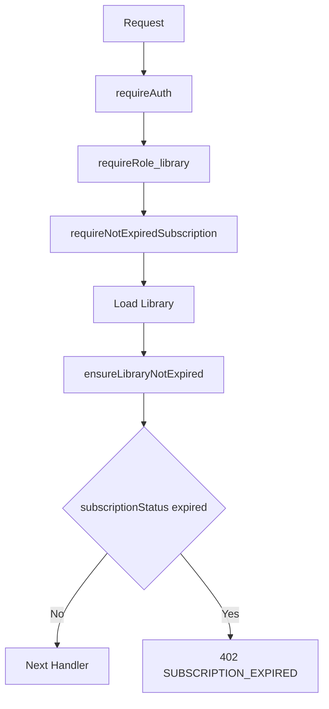
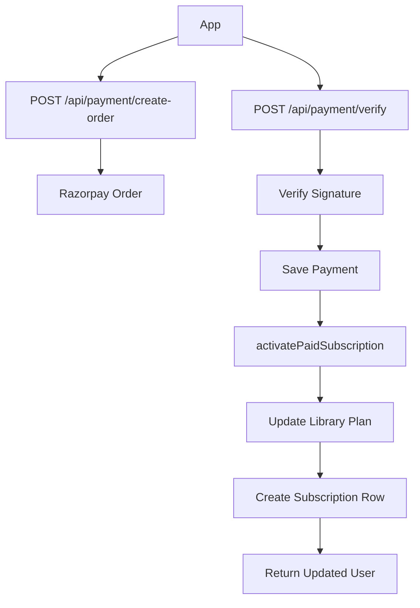
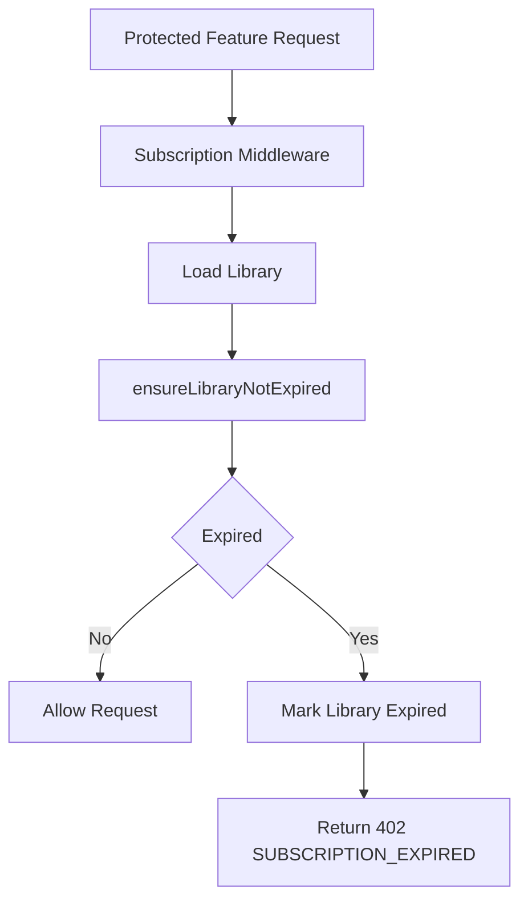

# Subscription README

This document explains the LibDesk backend subscription system: plans, payment activation, expiry behavior, middleware protection, response behavior, and production upgrade recommendations.

## Main Files

Subscription system files:

- `src/middleware/subscription.middleware.js`
- `src/utils/subscription.js`
- `src/routes/subscription.routes.js`
- `src/routes/payment.routes.js`
- `src/models/Library.js`
- `src/models/Subscription.js`
- `src/models/Payment.js`
- `src/models/Plan.js`

Related middleware:

- `src/middleware/auth.middleware.js`
- `src/middleware/role.middleware.js`
- `src/middleware/error.middleware.js`

## Data Model

### Library Subscription Fields

Stored in `src/models/Library.js`:

```js
plan: "free" | "pro"
currentPlanKey: "free" | "trial" | "monthly" | "6month" | "yearly"
trialUsed: boolean
subscriptionStatus: "inactive" | "active" | "cancelled" | "expired"
cancelledAt: Date | null
cancelReason: string | null
cancelNote: string | null
planStartDate: Date | null
planExpiryDate: Date | null
```

Meaning:

- `inactive`: library is registered but has no active plan.
- `active`: current plan is active.
- `cancelled`: renewal/access was cancelled, but access remains until `planExpiryDate`.
- `expired`: plan has expired and premium features should be blocked.

### Subscription History Model

Stored in `src/models/Subscription.js`:

```js
libraryId
plan: "free" | "trial" | "monthly" | "6month" | "yearly"
price
startDate
expiryDate
status: "active" | "cancelled"
paymentStatus: "paid" | "pending"
cancelledAt
cancelReason
cancelNote
```

This model is used for admin/billing history. The main access-control status is stored on `Library`.

## Plan Types

Current subscription utility has these internal catalog keys:

```js
free_trial
pro_monthly
pro_6_month
pro_yearly
```

Admin/payment plans use:

```js
free
trial
monthly
6month
yearly
```

Plan activation normally happens through payment verification, not direct upgrade.

## Core Utility

File:

```txt
src/utils/subscription.js
```

Important functions:

- `ensureLibraryNotExpired(library)`
- `upgradeLibraryPlan({ libraryId, planKey })`
- `activatePaidSubscription({ libraryId, plan })`

### `ensureLibraryNotExpired(library)`

This is the central expiry rule.

Behavior:

1. If no library is passed, returns `null`.
2. If `planExpiryDate` is missing, the plan is treated as non-expiring.
3. If current time is before expiry, the library is unchanged.
4. If expired:
   - `subscriptionStatus = "expired"`
   - `plan = "free"`
   - `currentPlanKey` is preserved or defaults to `"free"`
   - `trialUsed` is not reset
   - `planExpiryDate` is preserved for UI/audit
   - library is saved

Important: do not bypass this function when checking subscription expiry.

## Subscription Middleware

File:

```txt
src/middleware/subscription.middleware.js
```

Export:

```js
requireNotExpiredSubscription
```

Purpose:

- Blocks protected library features when the library subscription is expired.
- Allows non-library roles to pass through.
- Uses `ensureLibraryNotExpired()` before checking final status.

Current flow:



### Success

If subscription is valid:

```js
return next();
```

### Missing Library ID

If authenticated user has no `libraryId`:

```json
{
  "success": false,
  "data": null,
  "message": "Unauthorized"
}
```

HTTP status: `401`

### Library Not Found

```json
{
  "success": false,
  "data": null,
  "message": "Library not found"
}
```

HTTP status: `404`

### Expired Subscription

```json
{
  "success": false,
  "data": {
    "code": "SUBSCRIPTION_EXPIRED",
    "user": {
      "id": "LIBRARY_ID",
      "role": "library",
      "plan": "free",
      "currentPlanKey": "monthly",
      "trialUsed": true,
      "subscriptionStatus": "expired",
      "planExpiryDate": "2026-05-01T00:00:00.000Z"
    }
  },
  "message": "Subscription expired. Please upgrade to continue."
}
```

HTTP status: `402`

## Protected Routes

The subscription middleware is currently used on protected library feature routes.

Example from `src/routes/student.routes.js`:

```js
router.use(requireAuth, requireRole("library"), requireNotExpiredSubscription);
```

This means student mutation routes are blocked when the library subscription expires.

## Bypass Routes

Subscription checks should not block:

- `POST /api/auth/login`
- `POST /api/auth/refresh`
- `/api/subscription/*`
- `/api/payment/*`

Reason:

- Expired users must be able to login.
- Expired users must be able to refresh session.
- Expired users must be able to view subscription status.
- Expired users must be able to pay/upgrade.

Current mounting already keeps payment/subscription routes outside this middleware. If middleware is ever applied globally, add explicit bypass logic for these paths.

## Subscription API Routes

Base:

```txt
/api/subscription
```

### `GET /api/subscription/me`

Requires:

```js
requireAuth
requireRole("library")
```

Behavior:

1. Loads current library.
2. Calls `ensureLibraryNotExpired(library)`.
3. Checks latest `Subscription` row for cancelled status.
4. Returns current subscription user state.

Response:

```json
{
  "ok": true,
  "user": {
    "id": "LIBRARY_ID",
    "role": "library",
    "plan": "pro",
    "currentPlanKey": "monthly",
    "trialUsed": true,
    "subscriptionStatus": "active",
    "planStartDate": "2026-05-01T00:00:00.000Z",
    "planExpiryDate": "2026-06-01T00:00:00.000Z"
  }
}
```

### `POST /api/subscription/upgrade`

Direct upgrade is disabled.

Response:

```json
{
  "message": "Direct upgrade is disabled. Please complete payment to activate a plan.",
  "code": "UPGRADE_DISABLED"
}
```

HTTP status: `403`

### `POST /api/subscription/cancel`

Cancels future renewal/access after expiry. Access remains until `planExpiryDate`.

Request:

```json
{
  "reason": "too_expensive",
  "note": "Optional note"
}
```

Behavior:

1. Loads library.
2. Calls `ensureLibraryNotExpired(library)`.
3. Fails if no expiring plan exists.
4. Sets:
   - `subscriptionStatus = "cancelled"`
   - `cancelledAt = now`
   - `cancelReason`
   - `cancelNote`
5. Updates latest active `Subscription` row as cancelled.
6. Writes log action `subscription_cancelled`.

Response:

```json
{
  "ok": true,
  "user": {}
}
```

### `POST /api/subscription/retention-choice`

Stores retention flow analytics choice.

Request:

```json
{
  "choice": "accept_discount"
}
```

Allowed choices:

- `accept_discount`
- `continue_cancel`

Response:

```json
{
  "ok": true
}
```

## Payment Routes

Base:

```txt
/api/payment
```

### `POST /api/payment/create-order`

Requires:

```js
requireAuth
requireRole("library")
```

Behavior:

1. Loads library subscription fields.
2. Prevents buying another plan while current pro plan is still active.
3. Loads active `Plan`.
4. Prevents paying for free plan.
5. Enforces one-time trial.
6. Creates Razorpay order.

Response:

```json
{
  "ok": true,
  "orderId": "order_xxx",
  "keyId": "rzp_key",
  "amount": 99900,
  "currency": "INR",
  "planId": "PLAN_ID",
  "planKey": "monthly"
}
```

### `POST /api/payment/verify`

Behavior:

1. Validates plan.
2. Verifies Razorpay signature.
3. Falls back to Razorpay fetch when needed.
4. Saves `Payment`.
5. Calls `activatePaidSubscription()`.
6. Returns updated library user state.

Response:

```json
{
  "ok": true,
  "message": "Subscription activated",
  "user": {}
}
```

### `GET /api/payment/history`

Returns combined payment and subscription history for the library.

## Activation Flow



## Expiry Flow



## Frontend Behavior

When backend returns:

```json
{
  "message": "Subscription expired. Please upgrade to continue.",
  "data": {
    "code": "SUBSCRIPTION_EXPIRED"
  }
}
```

Frontend should:

1. Update current user subscription fields from `data.user`.
2. Redirect to subscription/payment screen.
3. Allow payment routes.
4. Block premium feature screens until payment succeeds.

## Logging

Current logs:

- `subscription_cancelled` through `writeLog()`.
- Payment verification logs through console messages in `payment.routes.js`.

Recommended enterprise logs:

- `subscription_checked`
- `subscription_expired_blocked`
- `subscription_auto_expired`
- `payment_order_created`
- `payment_verified`
- `payment_verification_failed`

Recommended fields:

```js
userId
role
libraryId
action
timestamp
ip
userAgent
metadata
```

The auth upgrade already added:

- `src/models/AuditLog.js`
- `src/utils/audit.js`

Subscription code can reuse `logAction()` for enterprise audit logging.

## Caching Recommendation

Current middleware loads `Library` from MongoDB on each protected request.

Recommended safe cache:

- Cache by `libraryId`.
- Short TTL: 30 to 60 seconds.
- Cache only subscription-safe fields.
- Attach loaded library to `req.library`.
- Invalidate after payment verification, cancel, upgrade, and retention changes.

Suggested utility:

```txt
src/utils/subscriptionCache.js
```

Suggested functions:

```js
getCachedLibrary(libraryId)
setCachedLibrary(libraryId, library)
invalidateLibrarySubscriptionCache(libraryId)
```

Redis can be added later behind the same utility if `REDIS_URL` is configured.

## Cron Job Recommendation

Current expiry happens lazily when a protected route or `/api/subscription/me` calls `ensureLibraryNotExpired()`.

Recommended production job:

```txt
src/jobs/subscriptionExpiry.job.js
```

Use `node-cron` to periodically mark expired subscriptions.

Recommended schedule:

```cron
0 * * * *
```

Meaning: every hour.

Job behavior:

1. Find libraries where:
   - `planExpiryDate < now`
   - `subscriptionStatus !== "expired"`
2. Set:
   - `subscriptionStatus = "expired"`
   - `plan = "free"`
   - keep `currentPlanKey`
   - keep `trialUsed`
   - keep `planExpiryDate`
3. Log summary count.
4. Write audit logs for affected libraries.

Env switch:

```env
SUBSCRIPTION_CRON_ENABLED=true
```

## Security Rules

Do:

- Always protect subscription feature routes with `requireAuth`.
- Use `requireRole("library")` before subscription middleware.
- Return `401` for missing auth.
- Return `402` for expired subscription.
- Do not expose payment secrets.
- Do not expose internal Razorpay errors directly.
- Do not reset `trialUsed` after expiry.

Do not:

- Block `/api/payment/*`.
- Block `/api/subscription/*`.
- Grant a second trial after expiry.
- Change `planExpiryDate` when marking expired.

## Production Checklist

- Set Razorpay env:

```env
RAZORPAY_KEY_ID=your_key
RAZORPAY_KEY_SECRET=your_secret
```

- Ensure `AUTH_JWT_SECRET` is configured.
- Add subscription middleware only to premium feature routes.
- Add cache invalidation after payment/cancel changes.
- Add scheduled expiry job.
- Add audit logging for subscription events.
- Monitor payment verification failures.
- Add indexes if subscription history grows large.

## Common Errors

### `Subscription expired. Please upgrade to continue.`

HTTP status: `402`

Cause:

- Library `planExpiryDate` is in the past.
- Middleware marked `subscriptionStatus = "expired"`.

Fix:

- Complete payment through `/api/payment/create-order` and `/api/payment/verify`.

### `No active expiring plan to cancel`

Cause:

- Library has no `planExpiryDate`.
- Usually free/non-expiring plan.

### `Plan is active until expiry`

Cause:

- Library already has an active pro plan.
- The system prevents changing plan before expiry.

### `Trial can be used only once`

Cause:

- `trialUsed = true`.
- Trial plan cannot be reused.

## Notes for Future Refactor

Current subscription and payment routes still contain route-level business logic. For a stricter MVC architecture, move logic into:

```txt
src/controllers/subscription.controller.js
src/services/subscription.service.js
src/controllers/payment.controller.js
src/services/payment.service.js
```

Keep API routes and response formats unchanged during that refactor.
